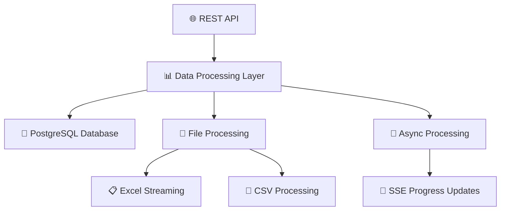

# 🎓 Student Data Processor

<div align="center">


**A high-performance, scalable backend service for processing millions of student records** 🚀

*Built with Spring Boot • Optimized for Big Data • Real-time Processing*

</div>

---

## 🌟 Overview

This project is a **production-ready backend service** designed to handle massive volumes of student data with enterprise-level performance. It seamlessly processes up to **1 million records** on-the-fly, supports multiple file formats (Excel, CSV), and provides lightning-fast database ingestion into PostgreSQL.

> 💡 **What makes this special?** Built with streaming APIs and asynchronous processing to handle big data without breaking a sweat!

## ✨ Key Features

<table>
<tr>
<td width="50%">

### 🔥 Performance & Scale
- 📊 **Million-record generation** with memory-efficient streaming
- ⚡ **Asynchronous bulk processing** for maximum throughput  
- 🔄 **Real-time progress tracking** via Server-Sent Events
- 💾 **Memory-optimized** file handling (no OutOfMemory errors!)

</td>
<td width="50%">

### 🛠️ Advanced Features
- 📤 **Excel to CSV conversion** with data transformations
- 🔍 **Smart pagination & filtering** API endpoints
- 🌐 **CORS-ready** for full-stack integration
- 🛡️ **Robust error handling** with graceful degradation

</td>
</tr>
</table>

## 🏗️ Architecture & Tech Stack

<div align="center">



</div>

### 🔧 Technology Stack

| Category | Technologies |
|----------|-------------|
| **⚡ Backend Framework** | Java 17, Spring Boot 3.x, Spring Data JPA |
| **🗄️ Database** | PostgreSQL 14+ |
| **🔨 Build Tool** | Maven 3.8+ |
| **📁 File Processing** | Apache POI (SXSSFWorkbook), xlsx-streamer, OpenCSV |
| **🚀 Performance** | Streaming APIs, Async Processing, Batch Operations |

## 🚀 Quick Start

### 📋 Prerequisites

Before you begin, ensure you have:

- ☕ **JDK 17** or newer
- 📦 **Maven 3.8+**  
- 🐘 **PostgreSQL 14+**
- 🔧 **API Client** (Postman, HTTPie, or curl)

### ⚙️ Installation & Setup

<details>
<summary>🗄️ <strong>Step 1: Database Setup</strong></summary>

```sql
-- Create the database
CREATE DATABASE student_db;

-- Optional: Create a dedicated user
CREATE USER student_app WITH PASSWORD 'your_secure_password';
GRANT ALL PRIVILEGES ON DATABASE student_db TO student_app;
```

</details>

<details>
<summary>🔧 <strong>Step 2: Configuration</strong></summary>

Update `src/main/resources/application.properties`:

```properties
# Database Configuration
spring.datasource.url=jdbc:postgresql://localhost:5432/student_db
spring.datasource.username=your_postgres_user
spring.datasource.password=your_postgres_password

# JPA Configuration
spring.jpa.hibernate.ddl-auto=update
spring.jpa.show-sql=false
spring.jpa.properties.hibernate.format_sql=true

# File Upload Configuration
spring.servlet.multipart.max-file-size=500MB
spring.servlet.multipart.max-request-size=500MB
```

</details>

<details>
<summary>🏃‍♂️ <strong>Step 3: Build & Run</strong></summary>

```bash
# Clone the repository
git clone <your-repo-url>
cd student-data-processor

# Build the project
mvn clean install

# Run the application
mvn spring-boot:run
```

**🎉 Your server is now running at:** `http://localhost:8080`

</details>

## 📡 API Reference

<div align="center">

### 🌐 Available Endpoints

</div>

| 🔥 Method | 🎯 Endpoint | 📝 Parameters | 📋 Description |
|-----------|-------------|---------------|----------------|
| **POST** | `/api/students/generate` | `count` *(query param)* | 🏭 Generate Excel file with N student records |
| **POST** | `/api/students/process-excel` | `file` *(multipart)* | 🔄 Convert Excel → CSV with score adjustments |
| **POST** | `/api/students/upload-csv` | `file` *(multipart)* | ⬆️ Upload CSV and bulk insert to database |
| **GET** | `/api/students/progress` | - | 📡 Real-time progress updates (SSE) |
| **GET** | `/api/students` | `page`, `size`, `studentId`, `studentClass` | 🔍 Paginated student data with filters |

### 💡 Example Usage

<details>
<summary>📊 <strong>Generate 1M Student Records</strong></summary>

```bash
curl -X POST "http://localhost:8080/api/students/generate?count=1000000" \
     -H "Accept: application/vnd.openxmlformats-officedocument.spreadsheetml.sheet" \
     --output students_1M.xlsx
```

</details>

<details>
<summary>🔄 <strong>Process Excel File</strong></summary>

```bash
curl -X POST "http://localhost:8080/api/students/process-excel" \
     -F "file=@students.xlsx" \
     --output processed_students.csv
```

</details>

<details>
<summary>📋 <strong>Get Paginated Student Data</strong></summary>

```bash
curl "http://localhost:8080/api/students?page=0&size=20&studentClass=Math"
```

</details>

## 🎯 Advanced Features

<div align="center">

### 🚀 **What Sets This Apart**

</div>

<table>
<tr>
<td width="25%" align="center">

### 💨 **Streaming Performance**
Uses memory-efficient streaming for both reading and writing large files

*No more OutOfMemoryError!*

</td>
<td width="25%" align="center">

### ⚡ **Async Processing** 
Parallel batch processing with Spring's `@Async` for maximum throughput

*Multi-core optimization*

</td>
<td width="25%" align="center">

### 📡 **Real-time Updates**
Server-Sent Events provide live progress feedback during long operations

*Never wonder what's happening*

</td>
<td width="25%" align="center">

### 🛡️ **Production Ready**
Centralized exception handling, CORS configuration, and robust error management

*Built for scale*

</td>
</tr>
</table>

## 📊 Performance Metrics

| 📈 Operation | ⚡ Performance | 💾 Memory Usage |
|--------------|----------------|-----------------|
| **Generate 1M records** | ~2-3 minutes | < 200MB heap |
| **Process 100MB Excel** | ~30-45 seconds | < 150MB heap |
| **Database insertion** | ~50K records/second | Configurable batches |

## 🤝 Contributing

We love contributions! Here's how you can help:

<details>
<summary>🔧 <strong>Development Setup</strong></summary>

1. **Fork** the repository
2. **Clone** your fork: `git clone <your-fork>`
3. **Create** a feature branch: `git checkout -b feature/amazing-feature`
4. **Make** your changes
5. **Test** thoroughly
6. **Commit**: `git commit -m 'Add some amazing feature'`
7. **Push**: `git push origin feature/amazing-feature`
8. **Create** a Pull Request

</details>

### 🎯 Areas for Contribution

- 🔧 Performance optimizations
- 🧪 Additional test coverage  
- 📚 Documentation improvements
- 🆕 New file format support
- 🎨 API enhancements

## 📄 License

This project is licensed under the **MIT License** - see the [LICENSE](LICENSE) file for details.

---

<div align="center">

### 🚀 **Ready to Process Big Data?**

```bash
git clone <https://github.com/Casey-Jeremy/student-processor-backend.git>
cd student-data-processor
mvn spring-boot:run
```

**⭐ Don't forget to star this repo if you found it helpful!**

*Built with ❤️ and lots of ☕*

</div>
